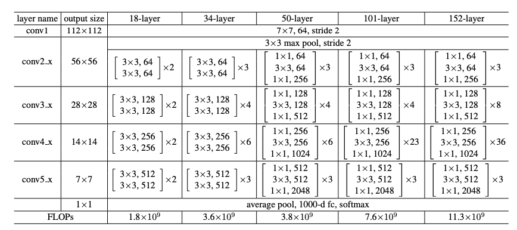

# CNN Architecture for Tensorflow
#### CNN 기반의 모델을 해당 논문을 보고 mnist, CUB-200 데이터 셋을 가지고 구현했습니다.

## Model Architectures 

### ResNet

#### Residual Learning

- 일반적인 네트워크는 출력 H(x)를 직접 학습합니다. 하지만 H(x)가 음수인 경우, ReLU를 통과하면서 0으로 변해 **정보 손실**이 발생할 수 있습니다.
- ResNet은 대신 **잔차(residual)** F(x) = H(x) - x 를 학습하게 하여, 출력은 H(x) = F(x) + x 로 표현됩니다.
- 이렇게 하면 모델이 학습해야 할 것은 "입력 자체"가 아닌 "입력의 변화량"만 학습하면 되므로 학습이 더 쉬워지고, **gradient vanishing** 문제가 줄어들어 더 깊은 네트워크도 학습 가능해집니다.

예: H(5) = -4 라면, ReLU를 통과하면 0이 되어 정보가 사라지지만,  
H(x) = F(x) + x 구조에서는 입력 x가 그대로 더해지므로 **정보 손실 없이 학습이 계속 유지될 수 있습니다.**

---

#### Identity Mapping by Shortcuts

- ResNet의 핵심 구조인 **Residual Block**에서는 입력 x를 그대로 출력에 더해주는 **skip connection (shortcut)** 을 사용합니다.
- 이 **identity mapping**은 신호 전달이 원활하게 이뤄지도록 도와주고, 학습이 깊은 네트워크에서도 안정적으로 되도록 합니다.